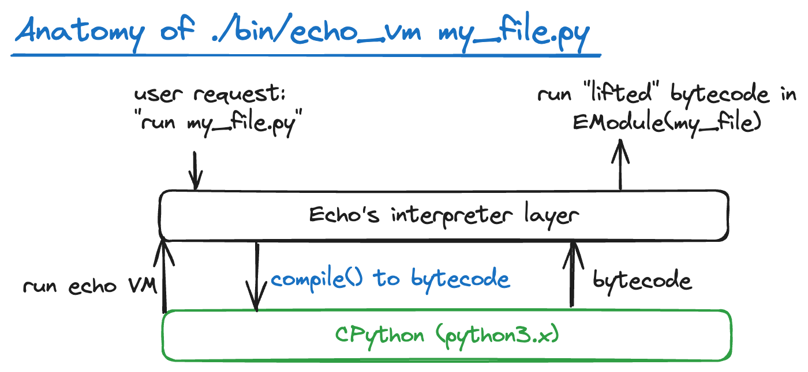

# echo

[](https://github.com/cdleary/echo/actions/workflows/ci.yml)

Experimental Python meta-circular evaluator. Inspired by the approach taken by
[Narcissus](https://github.com/mozilla/narcissus).

Implements a bytecode-level guest interpreter, reusing the host VM's front-end.
Note that the guest interpreter must be aware of the host VM's version, so it
can interpret bytecodes appropriately.

Implementation of builtin and functional constructs are the first priority for
implementation.



## Potential

By performing guest-interpreter evaluation via the host interpreter, we can:

* Remain fully compatible to CPython (e.g. extension capabilities), while
* Virtualize the language (e.g. for analysis/intercepting of control flow), and
* Potentially making the guest-language extensible in future work.

## Implementation Note

The implementation of echo is intimately related to the Python version it's
running on; e.g. if echo was last developed/updated for Python 3.7 and then it
is run on Python 3.10, there will be a lot of new bytecodes that it doesn't
know about. The implementation of echo must be updated for changes in CPython
versions since it implements the bytecode specification.

Also, as the standard library is changed from Python version to the next Python
version, novel constructs/combinations may be exposed that had not previously
been tested; i.e. `import X` may work fine in version 3.x but then encounter
difficulties in 3.y if the implementation of `X` changes significantly.

## Usage

The `echo.py` command line utility attempts to act like a substitute Python
driver that uses the guest interpreter instead of the host interpreter; e.g.

```
python3 echo.py /tmp/my_test.py
```

Ideally would match the results of direct invocation via the standard (host)
interpreter:

```
python3 /tmp/my_test.py
```

This is the property that echo attempts to build towards.

## Testing

py.test is driven via a configuration file in the root of the project
directory; so a developer can simply run:

```
py.test-3
```

To run particular tests with the logging level raised:

```
py.test-3 -k kwarg --log-cli-level=DEBUG
```

### Type checking

Type checking was previously done via pytype but is switching to be mypy based.

### CPython bytecode tracing

```
python bin/cpython_tracer.py py_samples/simple_binops.py
```

### REPL

A very partial read-eval-print-loop is present for experimentation:

```
$ ./bin/echo_repl
>>>
```

## Debugging

There is a mechanism to dump interpreter state as the bytecodes execute:

```
ECHO_DUMP_INSTS=1 ./bin/echo_vm  py_samples/simple_dict_comprehension.py
```

You can use this to "differential debug" against the CPython VM internals
(using a minimal tracer implemented using CPython `sys.settrace` hook and
`ctypes`):

```
$ ECHO_DUMP_INSTS=1 ./bin/echo_vm py_samples/knownf_try_except_reraise.py 2>&1 | tee /tmp/bad.txt
$ ./bin/minimal_tracer.py py_samples/knownf_try_except_reraise.py > /tmp/good.txt
$ vimdiff /tmp/bad.txt /tmp/good.txt
```

From here you can eyeball where the value stacks seem to diverge to understand
why echo may have produced a different result from CPython.

## Design Notes

Builtins are dispatched via `EBuiltin` in `eobjects.py` -- the implementations
for those are registered through decorated functions in `builtin_*.py` files.
